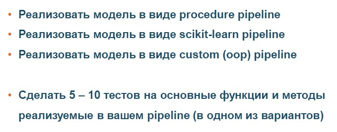

# deploy ml_course :rocket:


### Содержание :memo:
* [О курсе](#about)
* [Часть 1](#p1)
* [Часть 2](#p2)
* [Часть 3](#p3)
* [Часть 4](#p4)
* [Часть 5](#p5)
* [Часть 6](#p6)
* [Часть 7](#p7)
* [Часть 8](#p8)

<br>

-----------------------

### О курсе

>

<a name="about"></a>

Основная цель данного курса — сформировать у слушателей понимание того, как применяются модели машинного обучения и как их использовать для решения бизнес-задач.

Знание этих процессов поможет аналитикам и специалистам по машинному обучению максимально адаптировать свои решения к промышленной эксплуатации. По итогам курса вы сможете лучше ориентироваться в производственной среде и понимать жизненный цикл моделей машинного обучения.

В ходе прохождения курса вы научитесь выстраивать процесс разработки модели для продуктивного решения бизнес-задач, пройдете путь трансформации от jupyter notebook кода до контейнеризации модели и автоматизации необходимых для её работы процессов. В курсе также будет уделено внимание метрикам и способам мониторинга моделей.

В результате вы получите полное представление о процессе продуктивизации моделей, что позволит сократить время выхода на рынок ваших решений и поможет понять инженерный процесс разработки.

Курс разработан при поддержке [НИУ ВШЭ](https://cs.hse.ru/)

[Ссылка на курс на сайте НИУ ВШЭ](https://cs.hse.ru/dpo/announcements/414116513.html?fbclid=IwAR3L6Rv_APhsUJaBqNJnbl1TNg9Q9uhTHGGJDCGZwYB8lub0uJ93GKhRoQI)


**Знания для прохождения курса**

- Язык программирования Python (базовые библиотеки для Python, которые используются для работы с данными: numpy, pandas, sklearn)

- Знание принципов построения моделей машинного обучения

- Командная строка Linux

<br>

-----------------------

### Часть 1

> Вступительная часть к процессу продуктивизации моделей машинного обучения.

<a name="p1"></a>

#### Архитектуры ML приложений

Курс базируется на архитекутуре ML - _**train by batch, predict on fly**_


#### Виды ML pipeline (или модели вне jupyter notenook)

Будут рассмотрены основные виды ML Pipeline:

- Процедурные (на основе набора функций) с запуском через main.py

- Scikit-learn pipeline, построение и использование функций и классов в библиотеке Scikit-learn ([sklearn.pipeline.Pipeline](https://scikit-learn.org/stable/modules/generated/sklearn.pipeline.Pipeline.html))

- Custom (или объектно-ориентированный pipeline)

#### Тестирование

> Разбор основных видов тесто для ML проекта. В этой части рассматриваем 6 основных
вилов тестов, которые должны быть у модели и её процесса.
>
> Перед знакомством с тестами, научимся делать дебаг и поиск ошибок в коде на примере игры о [pdb](https://github.com/NameArtem/deployml_course/tree/main/p1/src/pdb_game)
>
> Познакомимся с тестами через учебный проект по тестированию кода для теннисного турнира [ссылка](https://github.com/NameArtem/deployml_course/tree/main/p1/src/pytest_game)
>
> Позапускаем тесты
>
> _Run_
```python
pytest /path_to_test_script.py
```
>
> _Run + html отчет_
```python
pytest /path_to_test_script.py --html=report.html --self-contained-html
```
>
> _Run + code coverage report (результат по каждой функции)_
```python
pytest /path_to_test_script.py --cov=src --verbose
```
>
> _Run + multi CPU_
```python
pytest /path_to_test_script.py -n 5
```

-------------------
*К основным видам тестов относятся:*

1
Smoke test - тесты для опредления метода
```python
import pytest
from sklearn.linear_model import LinearRegression
def test_smoke():
    try:
        assert LinearRegression() is not None
    except NameError:
        pytest.fail("Model does not exist")
```

2
Проверка коннекторов к БД (если нужны для проекта)

**[Ссылка на Хабр, с большим объяснением](https://habr.com/ru/post/141209/)**

```python
import mock

def get_connect():
    engine = sqlalchemy.create_engine('connection_string')

    return df.read_sql("select * from *", con = engine)

@mock.patch('pytest_ex.text_connection.sqlalchemy.create_engine')
def test_connection(engine_mock, df):
    new_df = get_connect(engine_mock)

    pandas.testing.assert_frame_equal(new_df, df)


# или тестировать функции чтения
def df_from_csv(filename):
    return pd.read_csv(filename)

@mock.patch.object(pd, 'read_csv')
def test_df_from_csv(read_csv_mock, df):
    read_csv_mock.return_value = df
    actual = df_from_csv('file_name.csv')
    # ожидаемый результат
    expected = df
    # assertions
    pd.testing.assert_frame_equal(actual, expected)
```

3
Тесты на равенство / соответствие результатов после трансформации объекта

- Использовать pandas testing:

    -- pandas.testing.assert_frame_equal (сравнение DataFrame)

    -- pandas.testing.assert_series_equal  (сравнение колонок)

    -- pandas.testing.assert_index_equal  (сравнение строк по индексам)

    -- pandas.testing.assert_extension_array_equal  (сравнение любых массивов numpy)

-- Использование assert + numpy (методы сравнения объектов):

    -- np.allclose

    -- np.isclose

    -- np.any

    -- np.equal

-- Использование numpy testing методов:

    -- (Ссылка на документацию numpy asserts)[https://numpy.org/doc/stable/reference/routines.testing.html]

4
Тестирование существования файлов
```python
def df_from_csv(filename):
    """читаем все DataFrame в формате csv"""
    return pd.read_csv(filename)

def test_df_from_csv(filename):
    assert df_from_csv(filename) is not FileNotFoundError
```

5
Тестирование API
```python
import responses

@responses.activate
def test_api_404():
    responses.add(
        responses.GET,
        'https://your_path',
        json='ex_json',
        status=404,
    )


@responses.activate
def test_api_200():
    responses.add(
        responses.GET,
        'https://your_path',
        json={'ex_json'},
        status=200,
    )
```

6
Генерируйте данные для тестов на основе [hypothesis](https://hypothesis.readthedocs.io)

```python
import pandas as pd
from hypothesis import given
from hypothesis import strategies
from hypothesis.extra.pandas import column, data_frames
import builder

@given(
    # создавайте Pandas DataFrame для тестов
    data_frames(
    columns=[
        column(
            name='prog_start',
            elements=strategies.datetimes(
                min_value=pd.Timestamp(2020, 1, 1),
                max_value=pd.Timestamp(2020, 1, 10)
            )
        , unique=True),
        column(
            name='code',
            elements=strategies.just(float('nan'))
        )
    ])
)
def test_fix_new_boxes_nan_replaced(raw_prog):
    prog = builder.fix_new_boxes(raw_prog)
    assert (prog.mat_code == builder.NO_MAT_CODE).all()
    assert prog.shape == raw_prog.shape
```

#### Задание для самостоятельной работы

* Воспользуйтесь [шаблонами](https://github.com/NameArtem/deployml_course/tree/main/p1_homework) для sklearn.pipeline и процедурного pipeline, переделайте свою модель из эксперементального jupyter notebook в 3 вида pipeline

**Задание**




<br>

------------

### Часть 2

>

<a name="p2"></a>

####

<br>

### Часть 3

>

<a name="p3"></a>

####

<br>

### Часть 4

>

<a name="p4"></a>

####

<br>

### Часть 5

>

<a name="p5"></a>

####

<br>

### Часть 6

>

<a name="p6"></a>

####

<br>

### Часть 7

>

<a name="p7"></a>

####

<br>


### Часть 8

>

<a name="p8"></a>

####

<br>
