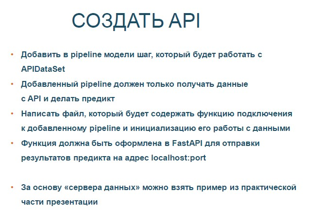
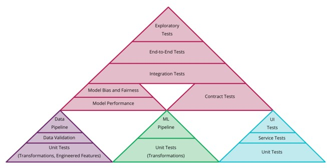
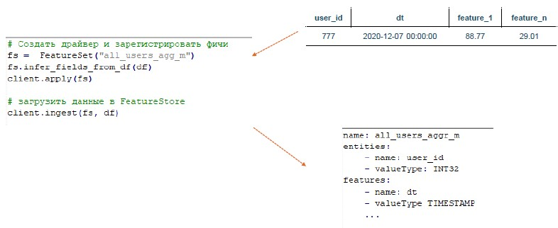
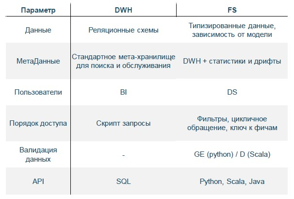
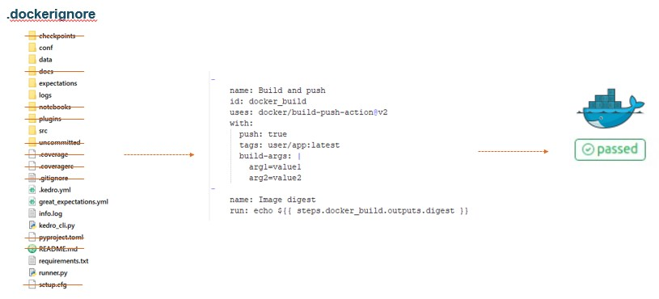

# deploy ml_course :rocket:


### Содержание :page_with_curl:
* [О курсе](#about)
* [Jupyter в ProductCode](#p1)
* [Версионирование процесса](#p2)
* [API для модели](#p3)
* [СI/CD](#p4)
* [Feature Store](#p5)
* [Docker](#p6)
* [AirFlow](#p7)
* [Часть 8](#p8)

<br>

-----------------------

### О курсе :key:

>

<a name="about"></a>

Основная цель данного курса — сформировать у слушателей понимание того, как применяются модели машинного обучения и как их использовать для решения бизнес-задач.

Знание этих процессов поможет аналитикам и специалистам по машинному обучению максимально адаптировать свои решения к промышленной эксплуатации. По итогам курса вы сможете лучше ориентироваться в производственной среде и понимать жизненный цикл моделей машинного обучения.

В ходе прохождения курса вы научитесь выстраивать процесс разработки модели для продуктивного решения бизнес-задач, пройдете путь трансформации от jupyter notebook кода до контейнеризации модели и автоматизации необходимых для её работы процессов. В курсе также будет уделено внимание метрикам и способам мониторинга моделей.

В результате вы получите полное представление о процессе продуктивизации моделей, что позволит сократить время выхода на рынок ваших решений и поможет понять инженерный процесс разработки.

Курс разработан при поддержке [НИУ ВШЭ](https://cs.hse.ru/dpo)

[Ссылка на курс на сайте НИУ ВШЭ](https://cs.hse.ru/dpo/announcements/414116513.html?fbclid=IwAR3L6Rv_APhsUJaBqNJnbl1TNg9Q9uhTHGGJDCGZwYB8lub0uJ93GKhRoQI)


**Знания для прохождения курса**

- Язык программирования Python (базовые библиотеки для Python, которые используются для работы с данными: numpy, pandas, sklearn)

- Знание принципов построения моделей машинного обучения

- Командная строка Linux

<br>

### Видео - плайлист курса на YouTube

[YouTube](https://www.youtube.com/playlist?list=PLEwK9wdS5g0qBXa94W7W0RNmrE0Ruook4)

-----------------------

### Часть 1 (Jupyter в ProductCode) :beginner:

> Вступительная часть к процессу продуктивизации моделей машинного обучения.

<a name="p1"></a>

Отвечая на вопрос, какие умения разработчика важны для DS, можно вспомнить статью [software dev skills for ds](http://treycausey.com/software_dev_skills.html) от Trey Causey и сказать:

- уметь тестировать
- уметь версионировать
- уметь логгировать [-> отличный пример](https://webdevblog.ru/logging-v-python/)
- уметь писать модули


#### Архитектуры ML приложений

Курс базируется на архитекутуре ML - _**train by batch, predict on fly**_


#### Виды ML pipeline (или модели вне jupyter notenook)

Будут рассмотрены основные виды ML Pipeline:

- Процедурные (на основе набора функций) с запуском через main.py

- Scikit-learn pipeline, построение и использование функций и классов в библиотеке Scikit-learn ([sklearn.pipeline.Pipeline](https://scikit-learn.org/stable/modules/generated/sklearn.pipeline.Pipeline.html))

- Custom (или объектно-ориентированный pipeline)

#### Тестирование

> Разбор основных видов тесто для ML проекта. В этой части рассматриваем 6 основных
вилов тестов, которые должны быть у модели и её процесса.
>
> Тесты помогут: **найти баги, подтвердить ваши ожидания от результата, ещё разв взглянуть на код (и может написать его проще), упрощают совместную работу, меньше удивляться от результата**.
>
> Перед знакомством с тестами, научимся делать дебаг и поиск ошибок в коде на примере игры о [pdb](https://github.com/NameArtem/deployml_course/tree/main/p1/src/pdb_game)
>
> Познакомимся с тестами через учебный проект по тестированию кода для теннисного турнира [ссылка](https://github.com/NameArtem/deployml_course/tree/main/p1/src/pytest_game)
>
> Позапускаем тесты
>
> _Run_
```python
pytest /path_to_test_script.py
```
>
> _Run + html отчет_
```python
pytest /path_to_test_script.py --html=report.html --self-contained-html
```
>
> _Run + code coverage report (результат по каждой функции)_
```python
pytest /path_to_test_script.py --cov=src --verbose
```
>
> _Run + multi CPU_
```python
pytest /path_to_test_script.py -n 5
```

-------------------

##### Объекты для которых нужны тесты

- Объекты извлекающие данные
- Объекты трансформирующие данные
- Модель (если она самописная)
- Обекты сохранения данных

-------------------

##### Идея тестов

* Тестировать всегда один объект из процесса (кода). Т.е. один юнит за один тест
* Не использовать зависимости в тестируемом коде из других процессов (юнитов)
* Минимизировать запросы к API / Базе данных
* Тестировать свойства, не значения **(для DS|DE)**
* Тестировать типы и размерности **(для DS|DE)**
* Генерируйте фичи для теста ([feature forge](https://feature-forge.readthedocs.io)), а не создавайте руками **(для DS|DE)**
* Используйте базовые методы из Numpy и Pandas для тестирования **(для DS|DE)**

```Python
# тесты должны быть осмысленные

def mean(some_list):
  # на примере:
  # тест на пустой список и деление на 0
  # TypeError тест
  # OverFlow тест
  return sum(some_list) / len(some_list)

# dev тест
import pytest
def test_dev_mean():
  assert(sum(mean([1,2,3])) / len(3) == 2)

# Но для DS
from hypothesis import given
import hypothesis.strategies as st

@given(st.lists(st.integers()))
def test_ds_mean(some_list):
  assert mean(some_list) == sum(some_list) / len(some_list)
```

```python
# тесты с проверкой типов / размерности
@is_shape(5, 10)
@is_monotonic(strict = True)
@non_missing()
def my_funct(df, columns):
  pass

```


-------------------
*К основным видам тестов относятся:*

1
Smoke test - тесты для опредления метода
```python
import pytest
from sklearn.linear_model import LinearRegression
def test_smoke():
    try:
        assert LinearRegression() is not None
    except NameError:
        pytest.fail("Model does not exist")
```

2
Проверка коннекторов к БД (если нужны для проекта)

**[Ссылка на Хабр, с большим объяснением](https://habr.com/ru/post/141209/)**

```python
import mock

def get_connect():
    engine = sqlalchemy.create_engine('connection_string')

    return df.read_sql("select * from *", con = engine)

@mock.patch('pytest_ex.text_connection.sqlalchemy.create_engine')
def test_connection(engine_mock, df):
    new_df = get_connect(engine_mock)

    pandas.testing.assert_frame_equal(new_df, df)


# или тестировать функции чтения
def df_from_csv(filename):
    return pd.read_csv(filename)

@mock.patch.object(pd, 'read_csv')
def test_df_from_csv(read_csv_mock, df):
    read_csv_mock.return_value = df
    actual = df_from_csv('file_name.csv')
    # ожидаемый результат
    expected = df
    # assertions
    pd.testing.assert_frame_equal(actual, expected)
```

3
Тесты на равенство / соответствие результатов после трансформации объекта

- Использовать pandas testing:

    -- pandas.testing.assert_frame_equal (сравнение DataFrame)

    -- pandas.testing.assert_series_equal  (сравнение колонок)

    -- pandas.testing.assert_index_equal  (сравнение строк по индексам)

    -- pandas.testing.assert_extension_array_equal  (сравнение любых массивов numpy)

-- Использование assert + numpy (методы сравнения объектов):

    -- np.allclose

    -- np.isclose

    -- np.any

    -- np.equal

-- Использование numpy testing методов:

    -- (Ссылка на документацию numpy asserts)[https://numpy.org/doc/stable/reference/routines.testing.html]

4
Тестирование существования файлов
```python
def df_from_csv(filename):
    """читаем все DataFrame в формате csv"""
    return pd.read_csv(filename)

def test_df_from_csv(filename):
    assert df_from_csv(filename) is not FileNotFoundError
```

5
Тестирование API
```python
import responses

@responses.activate
def test_api_404():
    responses.add(
        responses.GET,
        'https://your_path',
        json='ex_json',
        status=404,
    )


@responses.activate
def test_api_200():
    responses.add(
        responses.GET,
        'https://your_path',
        json={'ex_json'},
        status=200,
    )
```

6
Генерируйте данные для тестов на основе [hypothesis](https://hypothesis.readthedocs.io)

```python
import pandas as pd
from hypothesis import given
from hypothesis import strategies
from hypothesis.extra.pandas import column, data_frames
import builder

@given(
    # создавайте Pandas DataFrame для тестов
    data_frames(
    columns=[
        column(
            name='prog_start',
            elements=strategies.datetimes(
                min_value=pd.Timestamp(2020, 1, 1),
                max_value=pd.Timestamp(2020, 1, 10)
            )
        , unique=True),
        column(
            name='code',
            elements=strategies.just(float('nan'))
        )
    ])
)
def test_fix_new_boxes_nan_replaced(raw_prog):
    prog = builder.fix_new_boxes(raw_prog)
    assert (prog.mat_code == builder.NO_MAT_CODE).all()
    assert prog.shape == raw_prog.shape
```

#### Задание для самостоятельной работы

* Воспользуйтесь [шаблонами](https://github.com/NameArtem/deployml_course/tree/main/p1_homework) для sklearn.pipeline и процедурного pipeline, переделайте свою модель из эксперементального jupyter notebook в 3 вида pipeline

**Задание**


<br>

------------

### Версионирование процесса

> Разбор основных способов версионирования в GIT с проекцией на деятельность DS/DE.

<a name="p2"></a>

#### GIT

Предложена мультиветвенная система версиониования для монолитного проекта. **! Определитесь с неймингом процессов!**

О Git flow для DE/DS и основными шаблонами можно ознакомиться [в другом репозитории](https://github.com/NameArtem/gitFlowDE)

По ссылке вы найдете:

* шаблон для проекта

* шаблон для adhoc

* шаблон для Spark проекта

* набор готового кода для git

Ещё немного информации о git - [больше волшебства](https://dangitgit.com/ru)


#### DVC

Рассмотрим инструмент [dvc](https://dvc.org/), отличный для экспериментов и фиксации процессов

```bash

dvc init

# отключаем аналитику наших процессов (чтобы не собиралась статистика)
dvc config core.analytics false

# устанавливаем наше хранилище для файлов
dvc remote add -d localremote /data/dvc-storage
```

----------------------------

Создаем params.yaml по шаблону:
```
# file params.yaml
название модели (эксперимента):
    параметры для эксперимента
```

----------------------------

Создаем шаги наших экспериментов (для трекинга):
```bash
dvc run -n STAGE_NAME \
-d все файлы от которых зависит процесс
-O все файлы, которые будут являться результатами процесса ( но не будут версионироваться)
-o все файлы, которые будут являться результатами процесса (будут версионироваться)
-M файл с метрикой
```

----------------------------

Основные команды для процессинга

```bash
# воспроизведение процесса (повторение от шага 1 до финального)
dvc repro

# сравнение параметров / метркиа
dvc params diff
dvc metrics diff

# визуализация процесса
dvc dag
```

---------------------------

<br>

#### KEDRO

Отличный проект [kedro](https://kedro.readthedocs.io/en/stable/), на основе которого будут выстроеные процессы на данном курсе

Проект является набором правил для разработки в МЛ. Но во время работы следует учитывать:
 * Не удалять (только дополнять) файл `.gitignore`
 * Работать в рамках [конвенции DE разработки](https://kedro.readthedocs.io/en/stable/12_faq/01_faq.html?highlight=convention#what-is-data-engineering-convention)
 * Переменные и конфиги эфемерные
 * Конфиги в `conf/local/`

```
# создать структуру проекта
kedro new

# в src/projectname/
# нужно создать pipeline (для каждого типа процессов - свой пайплайн)

# запуск jupyter notebook в kedro
kedro jupyter notebook
```

--------------------------

В проекте должны быть следующие pipelines:

- data engineering(etl + обработка данных)

- data science(обучение модели)

- predict_pipeline(предикт по модли и проверка качестве)

- predictapi_pipeline(предикт для работы через API)


```python
# добавляем созданные pipeline
# в hook для запуска
de_pipe = de.create_pipeline()
ds_pipe = ds.create_pipeline()
pr_pipe = pr.create_pipeline()
pra_pipe = pra.create_pipeline()

return {
    "de": de_pipe,
    "ds": ds_pipe,
    "predict": pr_pipe,
    "predict_api": pra_pipe,
    "__default__": de_pipe + ds_pipe + pr_pipe,
}
```

Это позволяем запускать код по имени pipeline

```
# в bash
kedro run --pipeline='predict_api'

# в функции python
context.run(pipeline_name='predict_api')
```

-----------------------------

Pipeline модели в Kedro (у данного проекта)


#### Задание для самостоятельной работы

**Задание**


<br>

------------


### API для модели

> Зачем DS/DE знать про API?

Для выполнения данной работы вам может понадобиться: сервер API, получатель API.
Вы сможет найти их простые реализации [здесь](https://github.com/NameArtem/deployml_course/tree/main/p3_api_serv)


<a name="p3"></a>

В данной работе мы сделаем выбор 1 из 3 основных реализаций API.


Мы будем использовать паттерны, которые поставляются с Kedro.

```python
# подключаем контекст Kedro
from kedro.context import load_context
from kedro.extras.datasets.api import APIDataSet
import json

# загружаем проект
context = load_context("../")
catalog = context.catalog

# используя APIDataSet из Kedro
# и устанавливаем конфиг
st = APIDataSet(
        url = "http://127.0.0.1:9876/data",
        headers = {"content-type": "application/json"}
).load()

# записываем в DF для работы из json
df = pd.DataFrame.from_dict(st.json()['data'], orient='index').T

# формируем результат для отправки назад по API
answer = {
        "predict_date": st.headers['date']
        "row_index": st.json()['index']
        "predict": model.predict(df)
}
```

<br>

------------

#### Задание для самостоятельной работы

**Задание**



<br>

------------


### CI/CD

> Разработка через тестирование для DS - реальность!

<a name="p4"></a>

Рассмотрим, какие тесты нужно делать для DS/DE пайплайнов и как их делать. И немного погрузимся в методологию TDD.

Опять переделаем пайплайн, так как рассмотрев [пример](notebooks/testProblem.ipynb) проблемы и поймем, что делали работу не по TDD методологии.





</br>

#### Тесты с hypothesis

Рассмотрим пример разработки теста для функции:
```python
# функция для тестирования
def index_creator(df, mind, maxd, freq):
    by = 'Station'
    newCol = 'Datetime'
    return pd.MultiIndex \
             .from_product([df[by].sort_values().unique(),
                            pd.Index(pd.date_range(mind,
                                                   maxd,
                                                   freq=freq))],
                            names=[by, newCol])
```

Скрипт по разработке теста

```python
import pandas as pd
import numpy as np

from hypothesis import given
from hypothesis import strategies as st
from hypothesis.extra.pandas import data_frames, column
from scipy.special import expit

import matplotlib.pyplot as plt
import seaborn as sns


# создадим DF для работы (генерация случайного ДатаФРейма)
# генерация данных для функции
# получаем элементы из given
# создаем случайный
import string

df = data_frames(
        [
            column('Station', dtype=str,
                   elements=st.text(alphabet=f"{string.ascii_letters}{string.ascii_lowercase}", min_size=5)),
            column('DateOfPeriod',
                   elements=st.datetimes(min_value=datetime.datetime.strptime('2019-01-01 00:00:00', '%Y-%m-%d %H:%M:%S'),
                                         max_value=datetime.datetime.strptime('2021-01-01 00:00:00', '%Y-%m-%d %H:%M:%S'))),
        ]
    ).example()

# создаем переменные для даты и время
mn = st.datetimes(min_value=datetime.datetime.strptime('2019-01-01 00:00:00', '%Y-%m-%d %H:%M:%S'),
                 max_value=datetime.datetime.strptime('2021-01-01 00:00:00', '%Y-%m-%d %H:%M:%S')).example()
mx = st.datetimes(min_value=datetime.datetime.strptime('2019-01-01 00:00:00', '%Y-%m-%d %H:%M:%S'),
                 max_value=datetime.datetime.strptime('2021-01-01 00:00:00', '%Y-%m-%d %H:%M:%S')).example()


# что нам нужно получить для функции
# переменные
mind = mn
maxd = mx
freq = 'H'
# константы
by = 'Station'
newCol = 'Datetime'

pd.MultiIndex \
  .from_product([df[by].sort_values().unique(),
                 pd.Index(pd.date_range(mind,
                                        maxd,
                                        freq=freq))],
                 names=[by,
                        newCol])

# тесты
# соответсвие класса (smoke)
index_creator(df, mn, mx, 'D').__class__ == pd.core.indexes.multi.MultiIndex
# правильный способы проверки класса
isinstance(index_creator(df, mn, mx, 'D'), pd.MultiIndex)
# что будет в нужной структуре и не пустой индекс с уровнями, именами и определителями
try:
    pd.testing.assert_index_equal(index_creator(df, mn, mx, 'D'),
                                      pd.core.indexes.multi.MultiIndex(levels = [['', '0'], []],
                                                                       names = ['Station', 'Datetime'],
                                                                       codes=[[], []]))
except AssertionError:
    True


with pytest.raises(AssertionError):
    pd.testing.assert_index_equal(index_creator(df, mn, mx, 'D'),
                                  pd.core.indexes.multi.MultiIndex(levels = [['', '0'], []],
                                                                   names = ['Station', 'Datetime'],
                                                                   codes=[[], []]))
```


</br>

</br>

#### GitHub Actions

Actions создаются в формате `YAML` и должны находится в папке `.github/workflows`.
В Actions учавствуют следующие элементы:
* **event** триггер к действияю
* **machine** место, где запускается джоб
* **The jobs** процесс выполняющий задачи
* **The steps** задачи для джоба

```yaml
#.github/workflows/first_workflow.yml
name: First Workflow                                               
on: push                                                  
jobs:                         
  first-job:                           
    name: Hello                         
    runs-on: ubuntu-latest                           
    steps:                           
    - name: Print a greeting                             
      run: echo Hellow!
```

**Использование Action**

Action - это одна задача, которая:

* Вызывается в том же репозитории, где и хранится код

* Который хранится отдельным репозиторием

* Который выполняется в контейнере

```yaml
# .github/workflows/first_workflow.yml
name: First Workflow
on: push                                                  
jobs:                         
  first-job:                           
    name: Hellow                  
    runs-on: ubuntu-latest                           
    steps:                           
      - name: Print a greeting                             
        run: echo Hello!   

      - name: Show ASCII greeting                             
        uses: mscoutermarsh/ascii-art-action@master   
        with:                               
          text: 'HELLO!'
```

**Интеграция Python в Action**

Для интеграции Python в GitHub Actions необходимо в контейнер установить Python, можно использовать специальный Action: `setup-python` и проверить доступность файлов через Action `checkout`.

```yaml
# .github/workflows/first_workflow.yml
name: First Workflow
on: push                                                  
jobs:                         
  get-posts-job:                            
    name: Run                      
    runs-on: ubuntu-latest     
    steps:                             
      - name: Check-out the repo under $GITHUB_WORKSPACE                               
        uses: actions/checkout@v2         

      - name: Set up Python 3.8                               
        uses: actions/setup-python@v2                               
        with:                                 
          python-version: '3.8'          

      - name: Install Scrapy                               
        run: pip install scrapy         

      - name: Run Python command                              
        run: scrapy runspider posts_spider.py -o posts.json
```

**Получить данные из Git с помощью Actions**

Ваши процессы могут возвращать результат, вы можете получать результат и скачивать его из Git с помощью Actions `upload-artifact` и `download-artifact`.

```yaml
# .github/workflows/first_workflow.yml
name: First Workflow
on: push                                                  
jobs:                         
  get-posts-job:                            
    name: Run          
    runs-on: ubuntu-latest     
    steps:                             
      - name: Check-out the repo under $GITHUB_WORKSPACE                               
        uses: actions/checkout@v2         

      - name: Set up Python 3.8                               
        uses: actions/setup-python@v2                               
        with:                                 
          python-version: '3.8'          

      - name: Install Scrapy                               
        run: pip install scrapy         

      - name: Run Python                              
        run: scrapy runspider posts_spider.py -o posts.json

      - name: Upload artifact                      
        uses: actions/upload-artifact@v2                        
        with:                                 
          name: posts                                 
          path: posts.json
```

**Создать Action самостоятельно**

Action создается, как Docker контейнер ([про Docker](#p6)), файл с описание парсится при с помощью TypeScript.

```yaml
name: 'Любое имя для GitHub Action'
description: 'Описание его действия, что ему нужно на вход и какой будет результат'
inputs:
  user:  
    description: 'Описание входящих данных'
    required: true
    default: 'Что будет по умолчанию'
runs:
  using: "composite"
  steps:
    - run: команда, которая запускает процесс
      shell: bash/ЯП
```

#### Примеры GitHub actions

```yaml
# Пример WorkFlow, который
# запускает установку Python и зависимостей, запускает tests


name: Tests
# для каких действий запускать данный WorkFlow
on:
  push:
    branches: [ main ]
  pull_request:
    branches: [ main ]
jobs:
  build:
    runs-on: ubuntu-latest
    steps:
    - uses: actions/checkout@v2
    - name: Set up Python 3.8
      uses: actions/setup-python@v2
      with:
        python-version: 3.8
    - name: Install dependencies
      run: |
        python -m pip install --upgrade pip
        pip install flake8 pytest
        if [ -f requirements.txt ]; then pip install -r requirements.txt; fi
    - name: Lint with flake8
      run: |
        # stop the build if there are Python syntax errors or undefined names
        flake8 . --count --select=E9,F63,F7,F82 --show-source --statistics
        # exit-zero treats all errors as warnings. The GitHub editor is 127 chars wide
        flake8 . --count --exit-zero --max-complexity=10 --max-line-length=127 --statistics
    - name: Test with pytest
      run: |
        pytest
```

```yaml
# Action для CodeReview

name: Code review
on:
  push:
  pull_request:
jobs:
  pycodestyle:
    name: pycodestyle
    runs-on: ubuntu-latest
    steps:
    - uses: actions/checkout@master
    - name: wemake-python-styleguide
      uses: wemake-services/wemake-python-styleguide@0.14.1
      with:
        reporter: 'github-pr-review'   # для репорта ошибок в PR комментарии
      env:
         GITHUB_TOKEN: ${{ secrets.GITHUB_TOKEN }}
```

</br>


#### Задание для самостоятельной работы


**Задание**


------------


### Feature Store

> Сделаем шаг в сторону от модели и рассмотрим специальный тип хранилища, но для DS.

<a name="p5"></a>

#### Great Expectations

[Great Expectations](https://docs.greatexpectations.io/en/latest/) - это специальный инструмент для тестирования данных и фиксации их профилирования.

GE встраиватся в pipeline для тестирования входных данных.


Создан для DE/DS:

* Помощь в работе с данными и мониторинге

* Помощь в нормализации данных

* Улучшение взаимодействия аналитиков и инженеров

* Построение автоматической верификации новых данных

* Ускорение поиска ошибок в данных

* Улучшение передачи данных между командами

* Построение документации для данных


Пример использования:

```python
import datetime
import numpy as np
import pandas as pd
import great_expectations as ge
import great_expectations.jupyter_ux
from great_expectations.datasource.types import BatchKwargs

# создаем контекст
context_ge = ge.data_context.DataContext("..")

# создаем набор параметров
expectation_suite_name = "bike.table.trips.st" # имя набора
context_ge.create_expectation_suite(expectation_suite_name)

# определяем тип ресурсов (вот, что мы забыли - 2)
context_ge.add_datasource('pandas_datasource', class_name='PandasDatasource')
batch_kwargs = {'dataset': catalog.load('trip_data'), 'datasource': "pandas_datasource"}

# создаем батч с данными и передаем в него имя набора, которое будет наполнять тестами
batch = context_ge.get_batch(batch_kwargs, expectation_suite_name)
```

Для дальнейшей работы с GE используйте [правила](https://docs.greatexpectations.io/en/latest/reference/glossary_of_expectations.html)

```python
# используем разные expectations для создания правил по данными
batch.expect_column_values_to_be_unique('Trip_ID')

# зафиксируем правила по данным и сохраним их
batch.save_expectation_suite(discard_failed_expectations=False)

# зафиксируем время создание данного обзора
run_id = {
  "run_name": "bike.train.part_trip",
  "run_time": datetime.datetime.utcnow()
}
results = context_ge.run_validation_operator("action_list_operator", assets_to_validate=[batch], run_id=run_id)


# сделаем валиадацию данных
df.tail(100).validate(expectation_suite=batch.get_expectation_suite())  #result

# создаем html документацию
context_ge.build_data_docs()
context_ge.open_data_docs()
```

GE сделаем ваши данные:


Использование GE в Kedro

```python
def data_qual(df: pd.DataFrame):
    """
    Функция для тестирования данных в pipeline
	Одна функция - одная проверка

    :param df:
    :return: df
    """
    df = ge.from_pandas(df)

    # создаем проверку
    result = df.expect_column_values_to_be_in_set('Subscriber_Type',
                                                  list(df['Subscriber_Type'].unique()),)
                                                  #mostly=.99)

    if not result['success']:
        err = result["exception_info"]
        raise Exception(f"You get unexpected data in Subscriber_Type column\n{err}")

    return df
```

Добавляем в пайплан Kedro

```python

# Создаем отдельный DataQuality pipeline
checked_pipe = Pipeline([node(q.data_qual,
                             "trip_data",
                             "trip_data_cheked")
                        ])

    return {
		# ставим на позицию перед основным pipeline
        "de": checked_pipe + de_pipe,

```

</br>

#### Feature Store

Существует проблема передачи фичей для моделей между командами и DS


Feature Store - инструмент, который получает таблицу с данными и отправляет на хранение. Имеет 2 вида объектов: ключи и данные (ввиде колонок)



Разница между DWH и Feature Store




</br>

#### Задание для самостоятельной работы


**Задание**


------------


### Docker 

> В этой части я попытался ответить на вопрос: "Нужен ли Docker для DS/DE?". Это отличное решение для изоляции разработок и мгновенной передачи в прод.. 
> Выбранные решения на базе Kedro + GitHub + GitHub Action позволяют пронести процесс от разработки до готового контейнера

<a name="p6"></a>


Формируем Docker контейнер на базе файла Dockerfile:

- FROM - на какой базе 
- ENV - установка окружения
- WORKDIR – создание директории для работы
- COPY / ADD– копируем с «машины» в Docker контейнер
- RUN - первые команды в Shell (выполнено / установлено)
- EXPOSE - указание портов
- CMD / ENTRYPOIN - что запустить в докере [команда, параметры,,,] 

Пример:

```yaml
FROM python:3.7

ENV PYTHONDONTWRITEBYTECODE 1
ENV PYTHONUNBUFFERED 1

RUN apt-get update \
    && apt-get -y install gcc make \
    && rm -rf /var/lib/apt/lists/*

RUN pip install --no-cache-dir --upgrade pip

WORKDIR /model

# copy requirements.txt
COPY deployml_course/requirements.txt /model/requirements.txt

# install project requirements
RUN pip install --no-cache-dir -r requirements.txt

# copy project
COPY deployml_course/ /model

EXPOSE 6789

ENTRYPOINT [ "python" ]
CMD [ "runner.py"] 
```

Используейте `.dockerignore` + [GitHub Action](https://github.com/marketplace/actions/build-and-push-docker-images) для деплоя ваших разработок.



#### Задание для самостоятельной работы


**Задание**


<br>

------------


### AirFlow

>

<a name="p7"></a>

#### tbd

<br>

------------


### Часть 8

>

<a name="p8"></a>

#### tbd

<br>

------------
